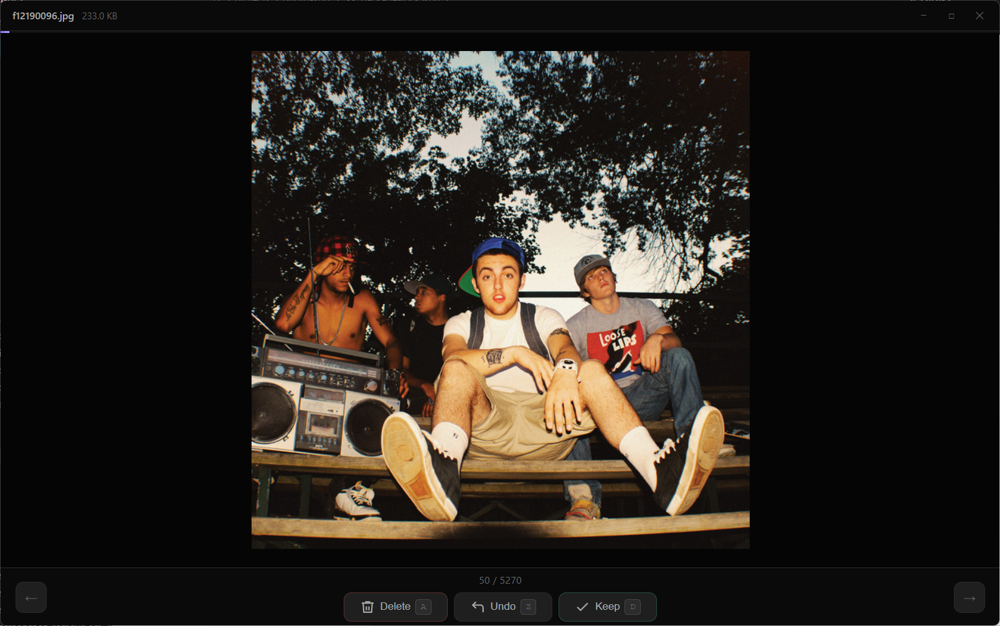

# PhotoSort

Keyboard-driven photo triage - blaze through thousands of photos and generate a clean delete script.




## Why

When you have 10,000 photos and just want to kill the blurry ones fast, clicking through a GUI is painful. PhotoSort keeps your hands on the keyboard - one key per decision, zero friction.

## How it works

1. Open a folder of photos
2. Press `A` to mark for deletion or `D` to keep - each advances automatically
3. Press `Z` to undo if you fat-finger it
4. At the end, review the stats and get a delete script
5. **Nothing is deleted until you run the script yourself** - you stay in control

On Windows the script is a `.bat` file. On macOS and Linux it is a `.sh` bash script.

## Controls

| Key | Action |
|-----|--------|
| `A` or `←` | Mark for deletion & advance |
| `D` or `→` | Keep & advance |
| `Z` | Undo last decision |

Hold `A` or `D` to rapid-fire through photos.

## Features

- Fullscreen, distraction-free view
- Progress bar and `X / Y` counter
- Red "MARKED FOR DELETION" badge on flagged photos
- Filename and file size in the title bar
- Preloads the next 3 images for instant navigation
- Generates a reviewable delete script - no silent deletes
- Copy script to clipboard or save to file
- Remembers window size between sessions
- Works on Windows, macOS, and Linux

## Supported formats

`jpg` `jpeg` `png` `gif` `webp` `bmp` `tiff` `heic` `avif`

## Download

Grab the latest installer from the [Releases page](https://github.com/jedbillyb/photo-sort/releases/latest) - no Node.js or build steps needed.

| Platform | File |
|----------|------|
| Windows | `PhotoSort.Setup.x.x.x.exe` |
| macOS (Apple Silicon) | `PhotoSort-x.x.x-arm64.dmg` |
| Linux | `PhotoSort-x.x.x.AppImage` |

## Running from source

```bash
git clone https://github.com/jedbillyb/photo-sort
cd photo-sort
npm install
npm start
```

Requires [Node.js](https://nodejs.org) (LTS).

## Building an installer

```bash
npm run build:win    # Windows NSIS installer → dist/
npm run build:mac    # macOS DMG (run on macOS)
npm run build:linux  # Linux AppImage → dist/
```

The icon is generated automatically before each build - no extra tools needed.

## Tech

Built with [Electron](https://www.electronjs.org/). No framework, no bundler - plain HTML/CSS/JS in the renderer.
