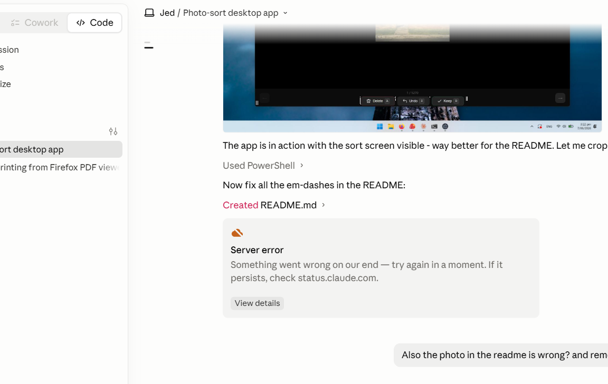

# PhotoSort

> Keyboard-driven photo triage - blaze through thousands of photos and generate a clean delete script.



## Why

When you have 10,000 photos and just want to kill the blurry ones fast, clicking through a GUI is painful. PhotoSort keeps your hands on the keyboard - one key per decision, zero friction.

## How it works

1. Open a folder of photos
2. `A` to mark for deletion, `D` to keep - each advances to the next photo
3. `Z` to undo if you fat-finger it
4. At the end, review the stats and get a `bash` script of `rm` commands
5. **Nothing is deleted until you run the script yourself** - you stay in control

## Controls

| Key | Action |
|-----|--------|
| `A` or `←` | Mark for deletion & advance |
| `D` or `→` | Keep & advance |
| `Z` | Undo last decision |

Hold `A` or `D` to rapid-fire through photos.

## Features

- Fullscreen, distraction-free view
- Progress bar + `X / Y` counter
- Red "MARKED FOR DELETION" badge on flagged photos
- Filename and file size in the title bar
- Preloads the next 3 images for instant navigation
- Generates a reviewable `bash` `rm` script - no silent deletes
- Copy script to clipboard or save to file
- Remembers window size between sessions

## Supported formats

`jpg` `jpeg` `png` `gif` `webp` `bmp` `tiff` `heic` `avif`

## Getting started

```bash
git clone https://github.com/jedbillyb/photo-sort
cd photo-sort
npm install
npm start
```

Requires [Node.js](https://nodejs.org) (LTS).

## Tech

Built with [Electron](https://www.electronjs.org/). No framework, no bundler - plain HTML/CSS/JS in the renderer.
